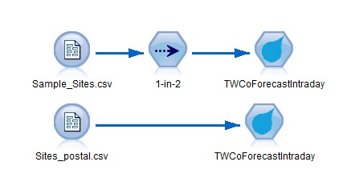

# Extension for TWCo Forecast Intraday
This implementation allows you to connect to APIs provided by The Weather Company from IBM SPSS Modeler. These APIs will require a key so that you can retrieve the actual weather data. Please contact your IBM sales representative so that we can assist you to obtain the key. 

---
# Overview

# Overview for Standard Site-Based Historical Observations
10 Day Intraday Forecast - Forecast for 6-hour periods starting today for the next 10 days.  Includes ‘morning’ (7am to 1pm), ‘afternoon’ (1pm - 7pm), ‘tonight’ (7pm - 1am), and ‘overnight’ (1am- 7am).

---
# Reference
[The Weather Company](http://www.theweathercompany.com/)  
[TWCo Forecast Intraday](http://goo.gl/w3aJuZ)

---
#Requirements

- IBM SPSS Modeler v18
- R Essentials for SPSS Modeler plugin 

More information here: [IBM Predictive Extensions][2]

---
Examples stream and data
----
Example folder include example stream and sample data

---
License
----

[Apache 2.0][1]

Contributors
----
- Yu Wenpei [(mail)](yuwenp@cn.ibm.com)

[1]:http://www.apache.org/licenses/LICENSE-2.0.html
[2]:https://developer.ibm.com/predictiveanalytics/downloads/#tab2
